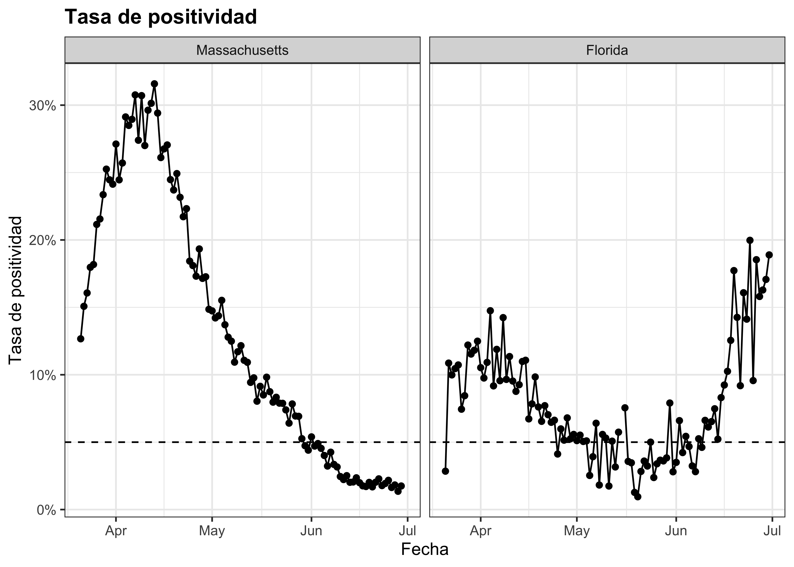
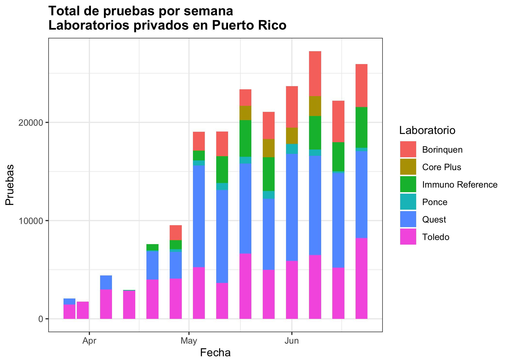
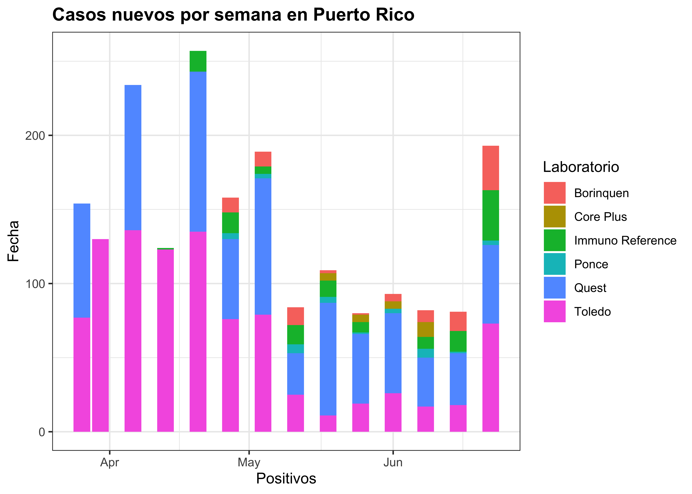
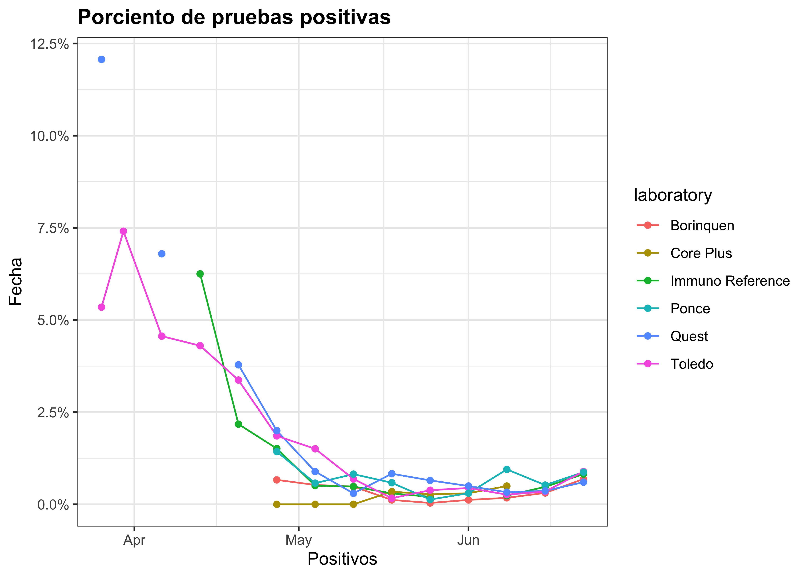
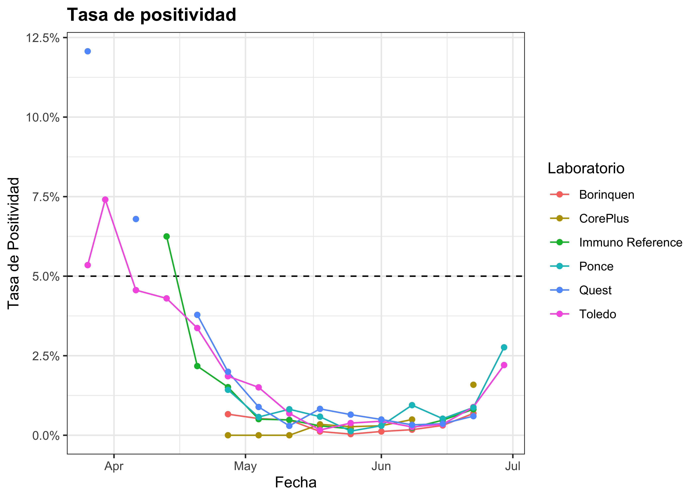
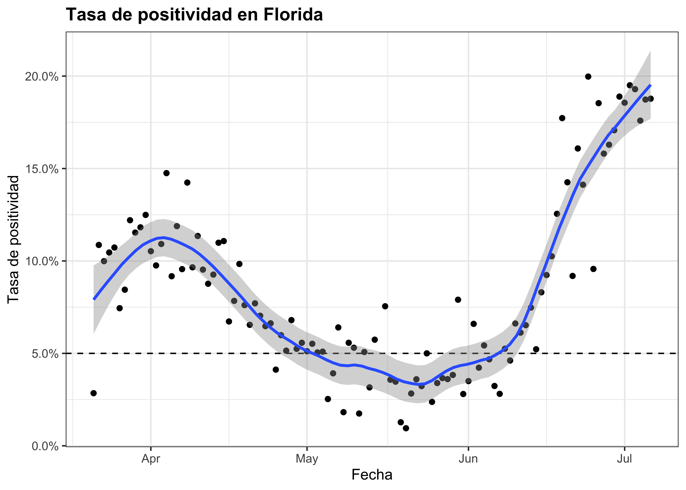
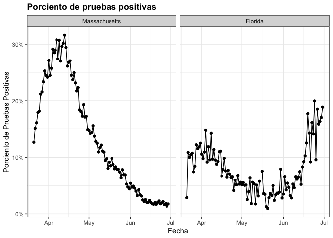
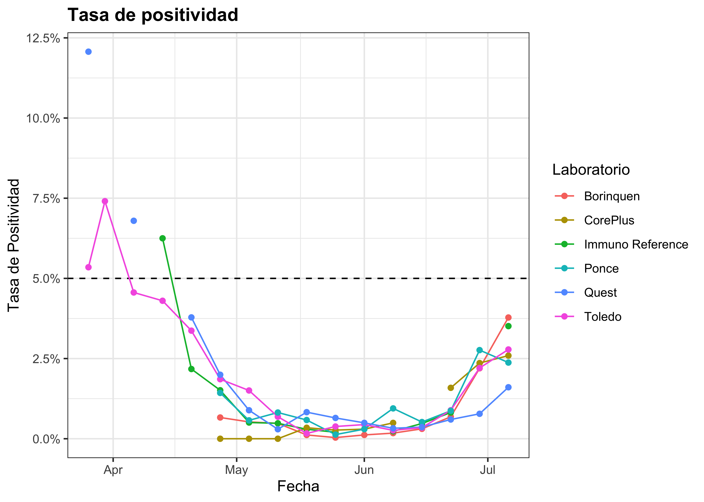

Monitoreando COVID-19 en Puerto Rico
================
Rafael Irizarry
6/30/2020

## Introducción

De los informes diarios que provee el Departamento de Salud es posible
extraer el número de pruebas moleculares positivas de COVID-19 que se
reportan diariamente. Desafortunadamente estos datos por si solos no son
útiles para monitorear la epidemia pues no sabes si un incremento en
casos se debe simplemente al hecho de que se están haciendo más pruebas.
Por lo tanto, necesitamos saber también cuantas pruebas salieron
negativas, no solo las positivas.

A pesar de ser uno de los peores estados afectados en EEUU,
Massachussets se ha destacado por la gran mejoría y [ayer anunciaron 0
muertes](https://www.bostonherald.com/2020/06/30/zero-new-coronavirus-deaths-reported-in-massachusetts-after-data-cleaning/)
por primera vez desde marzo. La epidemióloga del estado usa el
**porciento**, no el total, de casos positivos por día como el
instrumento principal de monitoreo. La Organización Mundial de la Salud
(WHO) aconseja que antes de reabrir, las tasas de positividad deberían
permanecer en 5% o menos por al menos 14 días.

Aunque el gobierno de Puerto Rico no comparte estos datos, Puerto Rico
Science Trust (PRST) recoge esta información semanalmente de los
laboratorios privados, los cuales hacen la gran mayoría de pruebas en
Puerto Rico. El PRST ha compartido estos datos y por primera vez puedo
calcular el porciento de casos positivos, aunque no son diarios sino
semanales. Aquí mostramos algunas gráficas.

## El patrón en Puerto Rico es parecido al de Nueva Zelandia

Las buenas noticias son que, basado en estos datos, parece que los
efectos de la pandemia han sido muy leves en Puerto Rico. En la
siguiente gráfica vemos los porcentajes de pruebas positivas por semana
para Massachusetts, Nueva Zelandia y Puerto Rico. Vemos que el patrón en
Puerto Rico se asemeja más a Nueva Zelandia que a Massachusetts. Noten
que los datos para Nueva Zelandia incluyen casos probables y confirmados
pues eso son los datos que proveen, mientras que para Puerto Rico y
Massachusetts solo incluimos casos confirmados con pruebas PCR.

<!-- -->

Aunque el porciento en Puerto Rico está bien bajo, es importante
continuar monitoreando estos datos. Preferiblemente con datos diarios en
vez semanales. Noten que en la última semana se ven un pequeño aumento
en el porciento para Puerto Rico. Si esto continua, pues nos debemos
preocupar.

## Este monitoreo demuestra problemas en Florida

Como ejemplo de cómo esto monitoreo puede ayudar, mostramos los datos de
Florida y los comparamos a los de Massachusetts donde la situación a
mejorado mucho. Vemos que en Florido el porciento ha estado aumentando
preocupantemente.

<!-- -->

## La tasa para las pruebas serologicas es diferente

Aquí definimos la tasa de positividad usando casos confirmados con
pruebas moleculars (PCR). Las pruebas serologicas resultan en tasas
diferentes. Aquí un ejemplo con Massachusetts:

<!-- -->

## Exploración de los datos de Puerto Rico

Los datos de Puerto Rico tienen algunas deficiencias. Por ejemplo los
totales reportados semanalmente no cuadran con los totales acumulados
reportados:

| laboratory       | total\_acumulado\_calculado | total\_acumulado\_reportado |
| :--------------- | --------------------------: | --------------------------: |
| Quest            |                       83355 |                       78020 |
| Toledo           |                       63475 |                       64520 |
| Borinquen        |                       27740 |                       30068 |
| Immuno Reference |                       22980 |                       36653 |
| Core Plus        |                        7072 |                        7848 |
| Ponce            |                        5317 |                        8002 |

En la siguiente gráfica vemos como las pruebas acumuladas han aumentado
hasta sobre 20,000 por semana.

<!-- -->

Cuando observamos los casos reportados por laboratorio vemos que algunos
laboratorios parecen no haber reportado todas las semanas.

<!-- -->

Finalmente vemos consistencia en los porcentajes de positividad
calculados con los datos de cada laboratorio:

<!-- -->

## Actualización con datos 2020-07-06

Solo dos laboratorios reportaron datos: Toledo y Ponce. Aquí la tasa de
positividad por semana basada en esos dos casos

<!-- -->

Estos son los datos para todos los laboratorios

<!-- -->

La subida en Puerto Rico ocurre alrededor de dos semanas de la subida en
Florida, EEUU.

<!-- -->

## Actualización con datos 2020-07-12

Esta es una actualización basad en datos proveidos el 12 de julio. Ahora
tenemos mas laboratorios completando los datos.

<!-- -->

Si usamos los datos reportados por semana, en vez de los acumulados, nos
da un resultado mas alto:

<!-- -->

Estos son los datos para todos los laboratorios. Notamos que Quest tiene
los valores más pequeños.

<!-- -->
