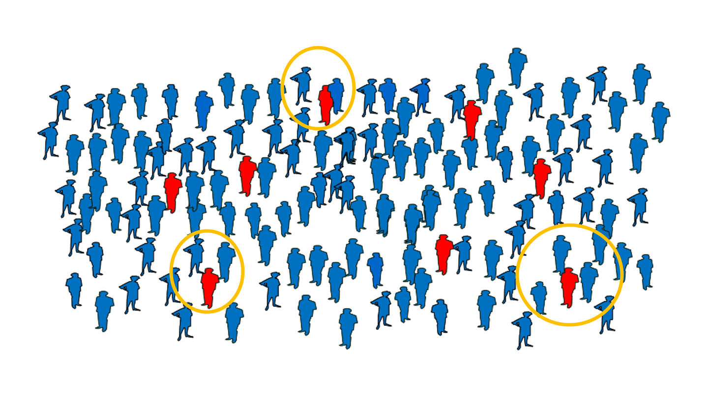
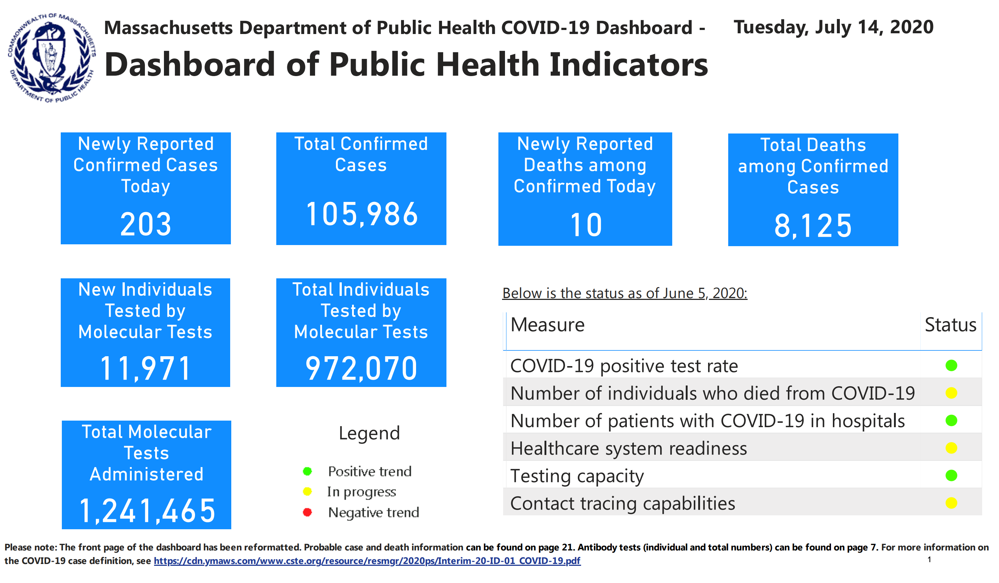
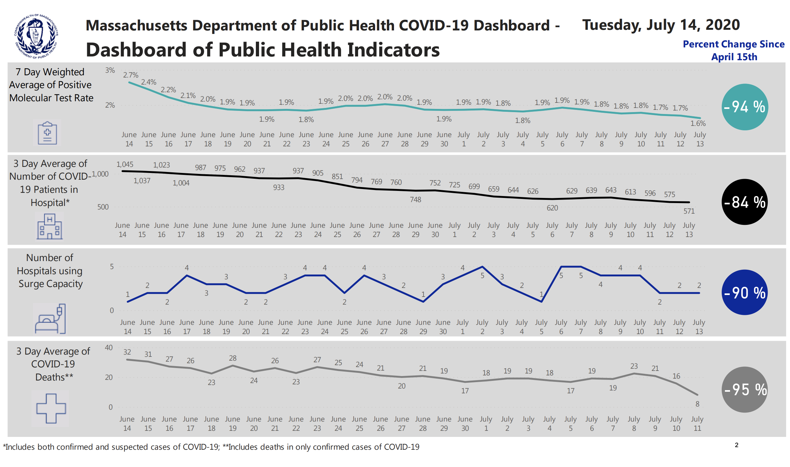
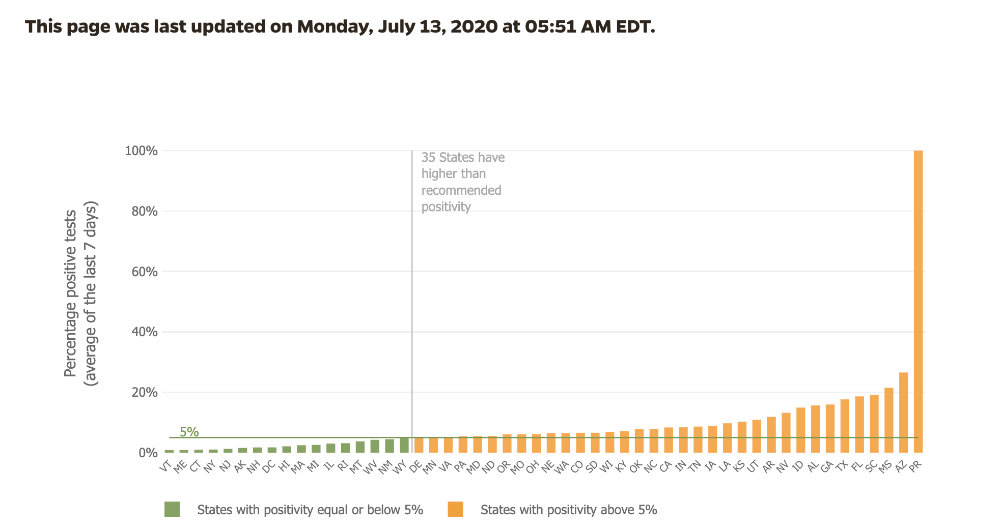
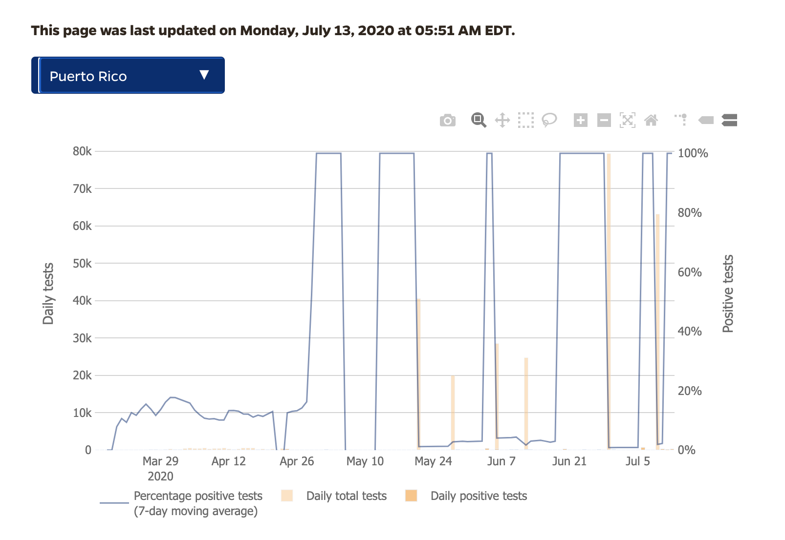
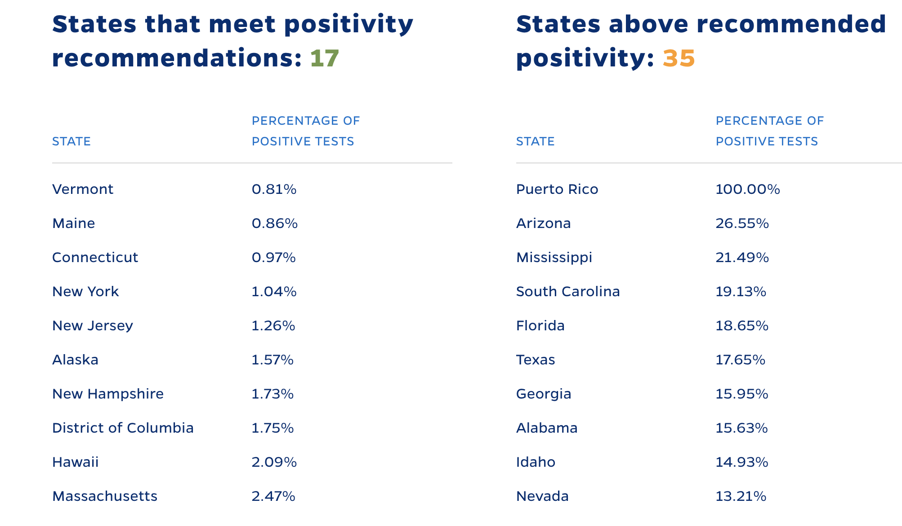

```{r setup, include=FALSE}
knitr::opts_chunk$set(echo = FALSE, fig.align="center", warning=FALSE, message=FALSE)
```


```{r}
library(tidyverse)
dslabs::ds_theme_set()
library(lubridate)
library(readxl)
library("twitterwidget")
```

##   

```{r, out.heigh=450, out.width=780}

```

## Propósito

Convencerlos de:

* La utilidad de visualizar datos
* Visualizar datos es más poderoso que usar modelos matemáticos 
* No basar decisiones en periodismo sensacionalista
* Organizar los datos sistemáticamente 
* No usar Microsoft Excel

## No soy experto en COVID-19

* Bachillerato en Matemática: UPR Río Piedras
* PhD en Estadísticas: UC Berkeley
* Estádistico Aplicado
* Director y Professor en Dana-Farber Cancer Institute
* Mi enfoque es en la génomica
* Pero he trabajado en varias otras aplicaciones
* @rafalab

## Mis colegas que sí son expertos


* Marc Lipsitch, Director, works on modeling the transmission of Coronavirus disease 2019. 

* Carolina Buckee, expert in transmission of infectious diseases through populations

* Michael Mina, develops and tests high-throughput serological surveillance of infectious pathogens

Todos del Center for Communicable Disease Dynamics en Harvard


## Marzo 11: Muy preocupado


```{r out.extra='class="center"'}
twitterwidget('1237756980338417665')
```

## Marzo 11: Muy preocupado

```{r}
knitr::include_graphics("https://pbs.twimg.com/media/ES1iMjbUMAcZlAh?format=png&name=small")
```

## Marzo 15: Menos preocupado

```{r}
twitterwidget('1239386321858240514')
```

## Marzo 25: Preocupado otra vez

58,000 = 2% de la población!

```{r}
twitterwidget("1242993012281675776")
```

## Modelos estadísticos verus matemáticos

Son diferentes

* Modelos matemáticos: hacen predicciones basados en ecuaciones diferenciales tratando de describir como funciona la naturaleza.

* Modelos estadísticos: ajustan modelos a datos observados basado en modelos que han funcionado en el pasado para situaciones parecidas.

* Visualización de datos: usa menos supuestos, pero permite descubrir patrones visualmente.

## Italia y España hasta marzo 25

```{r, cache=TRUE}
dslabs::ds_theme_set()

eudat <-read.csv("https://opendata.ecdc.europa.eu/covid19/casedistribution/csv",
                          na.strings = "", stringsAsFactors = FALSE,
                          fileEncoding = "UTF-8-BOM")
eudat <- eudat %>% as_tibble %>% mutate(dateRep = dmy(dateRep))

plot_eu <- function(x, 
                    start = make_date(2020,3,1), 
                    end = make_date(2020,3,25), 
                    ylim = c(0,800)
                    ){
  eudat %>% filter(countriesAndTerritories %in% x& 
                     dateRep >= start &
                     dateRep <= end)  %>%
    ggplot(aes(dateRep, deaths)) +
    geom_bar(stat = "identity") +
    xlab("Fecha") +
    ylab("Muertes") +
    scale_y_continuous(limits = ylim) +
    facet_wrap(~countriesAndTerritories)
}

plot_eu(c("Italy", "Spain"))
```


## Nueva York, Massachusetts y Puerto Rico

```{r, cache=TRUE}
states <- read_csv("https://covidtracking.com/api/v1/states/daily.csv") %>%
  mutate(date = ymd(date))
```

```{r}
plot_us <- function(x, 
                    start = make_date(2020,3,15), 
                    end = make_date(2020,3,25),
                    ylim = c(0,800)){
  states %>% filter(state %in% x,
                     date >= start &
                     date <= end)  %>%
    ggplot(aes(date, deathIncrease)) +
    geom_bar(stat = "identity") +
    xlab("Fecha") +
    ylab("Muertes") +
    scale_y_continuous(limits = ylim) +
    facet_wrap(~state, ncol = 1)
}

plot_us(c("NY", "MA", "PR"))
```

## Predecir es difícil

"It's hard to make predictions especially about the future" - Yogi Berra

"Forecasting s-curves is hard" - Constance Crozier

## Predecir es difícil

<iframe title="vimeo-player" src="https://player.vimeo.com/video/408599958" width="480" height="320" frameborder="0" allowfullscreen></iframe>


## Muertes por día hasta hoy

```{r}
plot_us(c("NY", "MA", "PR"), end = make_date(2020, 7, 10))
```

## Arizona, Texas, Florida
```{r}
plot_us(c("TX", "AZ", "FL"), end = make_date(2020, 7, 10))
```

## Arizona, Texas, Florida (close-up)
```{r}
plot_us(c("TX", "AZ", "FL"), end = make_date(2020, 7, 10), ylim = c(0, 175))
```

## Tasa de positividad

* Ya sabemos que la tasa de transmición es alta. 
* Se puede control con medidas como los lockdowns
* Quizás el dato más importante entonces es el número o porciento de infectados $I(t)$
* ¿Cómo lo estimamos? 
* El número de casos reportados no es un buen estimador

## Casos en Puerto Rico

```{r out.height=450}
knitr::include_graphics("https://images.jifo.co/39360305_1594646341759.png")
```

Source: Puerto Rico Institute of Statistics

## ¿Menos casos los fines de semana?

```{r}
load("rdas/bioportal-data-2020-07-14.rda")
tests %>%
  filter(date >= make_date(2020, 5, 1)) %>%
  group_by(weekday = wday(date)) %>%
  summarize(avg = mean(positives)) %>%
  mutate(weekday = factor(weekday, labels = weekdays(as_date(3:9)))) %>%
  ggplot(aes(weekday, avg)) +
  xlab("") +
  ylab("Número promedio de casos") +
  geom_bar(stat = "identity")
```

## ¿Tanto están creciendo los casos en EEUU?

```{r}
us <- states %>% group_by(date) %>%
  filter(date >= make_date(2020, 3, 15)) %>%
  summarize(cases = sum(positiveIncrease, na.rm=TRUE),
            tests = sum(positiveIncrease, na.rm=TRUE) +
              sum(negativeIncrease, na.rm=TRUE))
us %>% ggplot(aes(date, cases)) + 
  geom_bar(stat = "identity") +
  xlab("Fecha") +
  ylab("Casos reportados")
```

## Una razón es que se están haciendo muchas más pruebas 

```{r}
us %>% ggplot(aes(date, tests/10^3)) + 
  geom_bar(stat = "identity") +
  ylab("Miles de pruebas") +
  xlab("Fecha")
```


## Tasa Positividad toma esto en cuenta

```{r}
us %>% ggplot(aes(date, cases/tests)) + 
  geom_bar(stat = "identity") +
  ylab("Tasa de positividad") +
  xlab("Fecha") + 
  scale_y_continuous(labels = scales::percent)
```

## La tasa de positividad no está creciendo en todos los estados

```{r}
states %>% 
  filter(state %in% c("NY", "MA")) %>%
  filter(date >= make_date(2020, 3, 15)) %>%
  mutate(cases = positiveIncrease,
            tests = positiveIncrease + negativeIncrease)%>% 
  ggplot(aes(date, cases/tests)) + 
  geom_bar(stat = "identity") +
  scale_y_continuous(limits = c(0,.5), labels = scales::percent) +
  ylab("Tasa de positividad") +
  xlab("Fecha") + 
  facet_wrap(~state)
```


## Tasa de positividad 

Trata de estimar la prevalencia: el porciento de rojos ya que no podemos probar a todos. 

```{r}
knitr::include_graphics("img/prevalence1.png")
```

## Tasa de positividad 

Si solo hacemos pruebas a los sintomáticos el estimado es bien sesgado: mucho mayor que la tasa actual.

```{r}

```

## Tasa de positividad 

Si hacemos pruebas más universalmente, el estimado es menos sesgado. Los casos reportados aumentan con el número de pruebas aunque no aumente la tasa.
```{r}
knitr::include_graphics("img/prevalence3.png")
```

## Tasa de positividad 

Si hacemos pruebas más universalmente nuestra precisión mejora. Pero si la tasa real es baja esto puede ser una desperdicio de recursos.

```{r}
knitr::include_graphics("img/prevalence4.png")
```

## Problema en Puerto Rico

No se compartía cuántas pruebas se habían hecho.

## Dashboard de Massachusetts 

Massachusetts, que en mi opinion está monitoreando bien, lleva calculando y reportando la tasa de positividad por meses.

[https://www.mass.gov/info-details/covid-19-response-reporting#covid-19-daily-dashboard-](https://www.mass.gov/info-details/covid-19-response-reporting#covid-19-daily-dashboard-)

## Dashboard de Massachusetts 

```{r, out.height=400, out.width=680}

```

## Dashboard de Massachusetts 

También monitorean las hospitalizaciones y muertes.

```{r, out.height=400, out.width=680}

```

## Información obtenida del dashboard de PR 

```{r, out.height=400, out.width=680}

```

## Información obtenida del dashboard de PR

```{r, out.height=400, out.width=680}

```

## Información obtenida del dashboard de PR

```{r, out.height=400, out.width=680}

```


## Ahora tenemos datos

Obviamente esos resultados no son confiables.
Pero ahora esto va a mejorar pues tenemos datos compartidos por:

* Puerto Rico Public Health Trust
* Departamento de Salud

## Tasa de positividad en Puerto Rico

```{r}
load("rdas/bioportal-data-2020-07-14.rda")
```


```{r}
library(splines)
fit <- glm(positives ~ ns(date, df = 10),  offset = log(tests), family = "quasipoisson", data = tests)

tests$fit <- predict(fit, type = "response")/tests$tests
tests$se <- predict(fit, se = TRUE, type="response")$se.fit / tests$tests

tests %>% filter(date >= make_date(2020, 3, 15)) %>%
  ggplot(aes(date, rate)) +
  geom_hline(yintercept = 0.05, lty = 2) +
  geom_ribbon(aes(ymin = fit - 2.54*se, ymax = fit + 2.54*se), alpha = 0.5) +
  geom_point() +
  geom_line(aes(y = fit)) +
  scale_y_continuous(labels = scales::percent) +
  ggtitle("Tasa de positividad en PR\nWHO recomienda abrir si está por debajo de 5% por 14 días") +
  xlab("Fecha") +
  ylab("Tasa de positividad") +
  geom_vline(xintercept = make_date(2020, 7, 10), lty = 2) #+
  #annotate("text", x = make_date(2020, 7, 13), y= 0.2, label = "Datos aún ci", angle = 90)

ggsave("~/Desktop/positividad.png", width = 8, height = 8/1.6)
```

## Hospitalizaciones

También tenemos datos de hospitalizaciones:

```{r}
hosp <- read_xlsx("data/Dash Total.xlsx")
hosp %>% 
  ggplot(aes(Fecha, `Total de Personas Hospitalizadas COVID`)) +
  geom_point() + geom_smooth(span = 0.3)
```


## Hospitalizaciones

Una vez los datos están bien organizados, hacer una visualización es fácil:
```{r, eval = FALSE, echo = TRUE}
hosp <- read_xlsx("data/Dash Total.xlsx")
hosp %>% 
  ggplot(aes(Fecha, `Total de Personas Hospitalizadas COVID`)) +
  geom_point() + geom_smooth(span = 0.3)
```

## Exceso de Muertes

* ¿Estamos subestiando el efecto de la pandemia?
* Para tener una idea, podemos monitorear excesos de muertes. 
* Comparamos el total de todas las muertes a lo esperado basado en años normales.

## Exceso de Muertes en EEUU

```{r}
twitterwidget("1260724459532627968")
```

##  Exceso de Muertes en Puerto Rico 


Muertes en marzo 2019: 2489

Muertes en marzo 2020: 2720

Estimar el exceso es más complicado que simplemente restar estos dos porque:

- Hay variabilidad natural de año a año.
- El tamaño de la población está cambiando.
- La demografía de PR está cambiando: el porciento de viejos esta creciendo

```{r}
library(tidyverse)
library(lubridate)
library(excessmort)
library(directlabels)
dslabs::ds_theme_set()

# -- Puerto Rico hurricane dates
hurricane_dates  <- c(Hugo    = make_date(1989, 9, 118),
                      Georges = make_date(1998, 9, 21),
                      Maria   = make_date(2017, 9, 20))


# Excluding  1) years (starting in 7/1) that include events, 2) 2020 and 3) some outliers in 2001 -------------------
exclude_dates <- c(make_date(1989, 7, 1) + 0:365,
                   make_date(1998, 7, 1) + 0:365,
                   make_date(2017, 7, 1) + 0:365,
                   make_date(2014, 7, 1) + 0:365,
                   seq(make_date(2020, 1, 1), today(), by = "day"))


# define control regions --------------------------------------------------
control_dates <- seq(as.Date("2002-01-01"), as.Date("2013-12-31"), by = "day")


# collapse age groups -----------------------------------------------------
data("puerto_rico_counts")
the_breaks <- c(60, Inf)
counts <- collapse_counts_by_age(puerto_rico_counts, the_breaks) %>%
  group_by(date = round_date(date, unit = "week")) %>%
  summarize(outcome = sum(outcome),
            population = mean(population)) %>%
  compute_expected(exclude = exclude_dates)
```

## Datos imcompletos

Otro reto es que los datos del reigstro demográfico toman como 45 días en estar completos:

```{r}
 p <- collapse_counts_by_age(puerto_rico_counts, the_breaks) %>%
    filter(date >= make_date(2020,1,1) & date <= today()) %>%
    ggplot(aes(date, outcome)) +
  geom_point(alpha = 0.5) +
    ylab("Muertes diarias") +
    ggtitle("Muertes para mayores de 60 en PR en 2020") +
    xlab("Fecha")
print(p)
```


```{r}
## get estimates and define function
periods <- list(c(),
                seq(hurricane_dates[3], make_date(2018, 4, 1),  by = "day"),
                seq(hurricane_dates[2], make_date(1998, 12, 31),  by = "day"),
                seq(make_date(2020,3,15), make_date(2020,4,15), by = "day"),
                seq(make_date(2014, 7, 1), make_date(2015, 2, 1),  by = "day")
                )

starts <- c( make_date(2011,1,1),
             make_date(2017,1,1),
             make_date(1998,1,1),
              make_date(2018,6,1),
            make_date(2014,1,1))
              
            

ends <- c(rep(starts + 365*2,4), 365*2)


titles <- c("Muertes en Puerto Rico durante años normales\nentre mayores de 60. Curva azul es lo esperado",
            "Muertes en Puerto Rico luego de María\nentre mayores de 60",
            "Muertes en Puerto Rico luego de Georges\nentre mayores de 60",
            "Muertes en Puerto Rico durante pandemia COVID-19\nentre mayores de 60",
            "Muertes en Puerto Rico durante brote de Chikungunya\nentre mayores de 60")

make_pr_plot <- function(i){
  p <- with(counts,
       data.frame(date = date,
                  observed = outcome,
                  expected = expected,
                  color = ifelse(date %in% periods[[i]], "event", "ctr"))) %>%
    filter(date >= starts[i] & date <= ends[i]) %>%
    ggplot(aes(x = date)) +
    geom_point(aes(y = observed, color = color), alpha = 0.5, show.legend = FALSE) +
    geom_line(aes(y = expected), color = "blue") +
    ylab("Muertes semanales") +
    ggtitle(titles[i]) +
    xlab("Date") +
    scale_color_manual(values=c("black", "red")) +
    ylim(c(350, 735))
  return(p)
}
```

## Complicaciones 2: la población decrece, pero se pone más vieja

```{r}
library(ggrepel)
puerto_rico_counts %>%
  group_by(year = year(date)) %>%
  summarize(count = sum(outcome)) %>%
  ungroup() %>%
  filter(year >= 1985 & year < 2020) %>%
  ggplot(aes(year, count, label = count)) +
  geom_point() +
  geom_line() +
  geom_text_repel() +
  ggtitle("Muertes por año en Puerto Rico") + 
  ylab("Muertes") +
  xlab("Año")
```

## Complicaciones 2: la población decrese, pero se pone más vieja
```{r}
library(ggrepel)
puerto_rico_counts %>%
  filter(as.numeric(agegroup) >= 13) %>%
  group_by(year = year(date)) %>%
  summarize(rate = sum(outcome)/sum(population)*1000*365) %>%
  ungroup() %>%
  filter(year >= 1985 & year < 2020) %>%
  ggplot(aes(year, rate, label = round(rate))) +
  geom_point() +
  geom_line() +
  geom_text_repel() +
  ggtitle("Tasas de moralidad para mayored de 60 por año en Puerto Rico") + 
  ylab("Tasa de mortalidad") +
  xlab("Año")
```


## Marzo en otro años

Aquí vemos porque no debemos comparar solo dos años:

```{r}
library(ggrepel)
puerto_rico_counts %>%
  group_by(month = floor_date(date, unit = "month")) %>%
  summarize(count = sum(outcome)) %>%
  ungroup() %>%
  filter(month(month) == 3) %>%
  filter(year(month) >= 2010) %>%
  ggplot(aes(month, count, label = count)) +
  geom_point() +
  geom_line() +
  geom_text_repel() +
  ggtitle("Muertes en el mes de Marzo 2010-2020") + 
  ylab("Muertes") +
  xlab("Año")
```

## Actualización

* Hasta ahora no parece que hay un exceso de muertes preocupante en PR.
* Esto puede cambiar, rápidamente.
* En las próximas páginas mostramos ejemplos de años que si hubo exceso de muertes.

## Año típico 

```{r}
make_pr_plot(1)
```

## María

```{r}
make_pr_plot(2)
```

## Georges

```{r}
make_pr_plot(3)
```

## COVID-19

```{r}
make_pr_plot(4)
```

## Chikungunya

```{r}
make_pr_plot(5)
```

## Recomendaciones

* Organizen datos sistemáticamente
* Monitoreen con visualizaciones: tasa de positividad, hospitalizaciones y muertes
* Monitoreen por regiones geográficas
* Mis colegas expertos dicen: Control de aeropuertos
* Datos y código: [https://github.com/rafalab/pr-covid](https://github.com/rafalab/pr-covid)

## Agradecimientos

* Joshua Villafañe Delgado (Departamento de Salud)
* Danilo Trinidad Perez Rivera (Departamento de Salud)
* José A. López Rodriguez (Registro Demográfico)
* Wanda Llovet Díaz (Registro Demográfico)
* Marcos López Casillas (PRST)
* José Rodriguez Orenge (PRST)
* Caroline Buckee, Michael Mina, Marc Lipsitch (Harvard)
* Natalie Dean (University of Florida)


