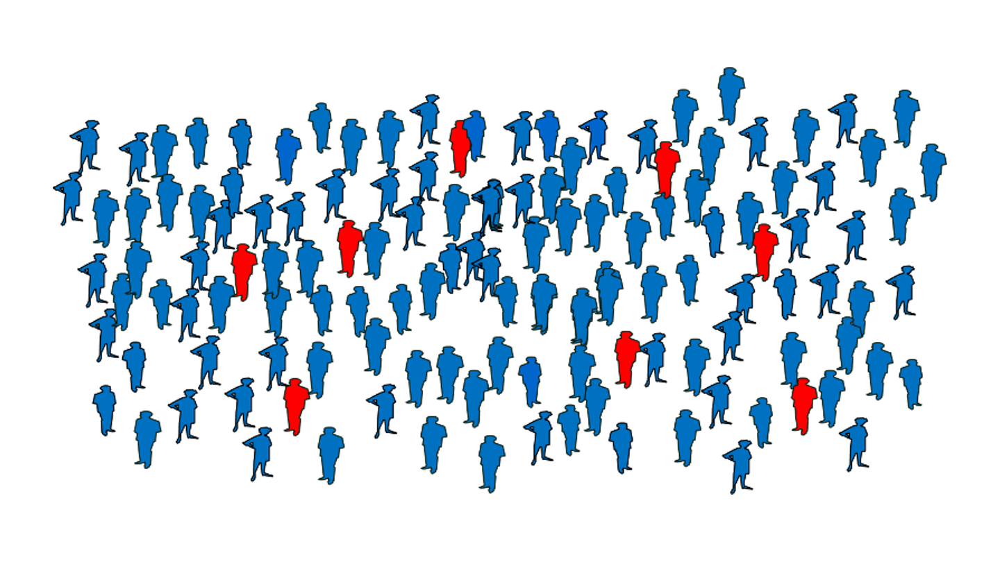
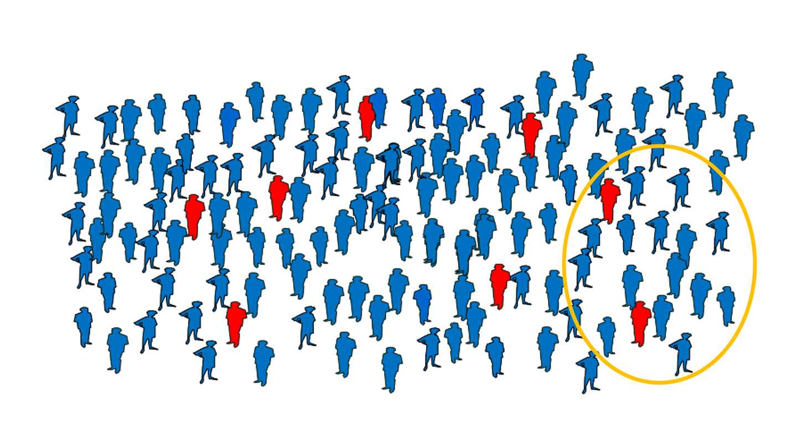
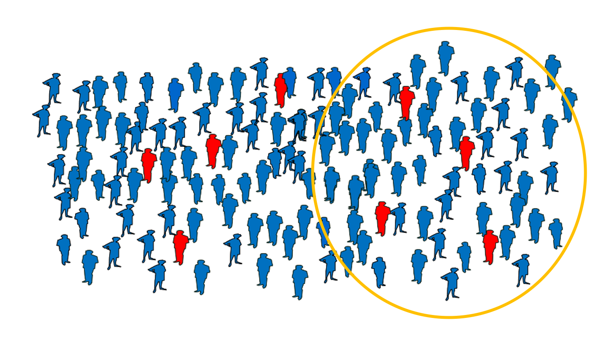

```{r setup, include=FALSE}
knitr::opts_chunk$set(echo = FALSE, fig.align="center", warning=FALSE, message=FALSE)
```


```{r}
library(tidyverse)
dslabs::ds_theme_set()
library(lubridate)
library(readxl)
library("twitterwidget")
```


## March 11: I was worried


```{r out.extra='class="center"'}
twitterwidget('1237756980338417665')
```

## March 11: Very worried

```{r}
knitr::include_graphics("https://pbs.twimg.com/media/ES1iMjbUMAcZlAh?format=png&name=small")
```

## March 15: A bit less worried

```{r}
twitterwidget('1239386321858240514')
```

## March 25: Holy sh*t!

58,000 = 2% of PR population!

```{r}
twitterwidget("1242993012281675776")
```

##  Mathematical Models versus Statistical Models versus EDA


* Mathematical: make prediction based on differential equations designed to describe how nature works

* Statistical: ajust models to **observed data**. We tend to limit to few models that have worked well in other scenarios.

* Visualization: less assumptions, but permits us to see patterns.


## Italy and Spain up to March 9

```{r, cache=TRUE}
dslabs::ds_theme_set()

eudat <-read.csv("https://opendata.ecdc.europa.eu/covid19/casedistribution/csv",
                          na.strings = "", stringsAsFactors = FALSE,
                          fileEncoding = "UTF-8-BOM")
eudat <- eudat %>% as_tibble %>% mutate(dateRep = dmy(dateRep))

plot_eu <- function(x, 
                    start = make_date(2020,3,1), 
                    end = make_date(2020,3,25), 
                    ylim = c(0,1000)
                    ){
  eudat %>% filter(countriesAndTerritories %in% x& 
                     dateRep >= start &
                     dateRep <= end)  %>%
    ggplot(aes(dateRep, deaths)) +
    geom_bar(stat = "identity") +
    xlab("Date") +
    ylab("Deaths") +
    scale_y_continuous(limits = ylim) +
    facet_wrap(~countriesAndTerritories)
}

plot_eu(c("Italy", "Spain"),  end = make_date(2020,3,9))
```

## Italy and Spain up to March 25
```{r}
plot_eu(c("Italy", "Spain"),  end = make_date(2020,3,25))
```

## Italy and Spain up to today
```{r}
plot_eu(c("Italy", "Spain"),  end = today())
```

## New York and MA up to March 25

```{r, cache=TRUE}
states <- read_csv("https://covidtracking.com/api/v1/states/daily.csv") %>%
  mutate(date = ymd(date))
```

```{r}
plot_us <- function(x, 
                    start = make_date(2020,3,15), 
                    end = make_date(2020,3,25),
                    ylim = c(0,800)){
  states %>% filter(state %in% x,
                     date >= start &
                     date <= end)  %>%
    ggplot(aes(date, deathIncrease)) +
    geom_bar(stat = "identity") +
    xlab("Date") +
    ylab("Deaths") +
    scale_y_continuous(limits = ylim) +
    facet_wrap(~state)
}

plot_us(c("NY", "MA"))
```


## Puerto Rico and Brazil up to March 25

```{r}
p1 <- plot_us(c("PR"), ylim = c(0,15))
p2 <- plot_eu(c("Brazil"), ylim = c(0,15))
gridExtra::grid.arrange(p1,p2, ncol = 2)
```

## Can we predict based on data?

"It's hard to make predictions especially about the future" - Yogi Berra

"Forecasting s-curves is hard" - Constance Crozier

##  Prediction is hard

<iframe title="vimeo-player" src="https://player.vimeo.com/video/408599958" width="480" height="320" frameborder="0" allowfullscreen></iframe>


## Here is what ended up happening 

```{r}
plot_us(c("NY", "MA"), end = make_date(2020, 8, 12))
```


## Positivity Rate
* We know transmission is high
* Lockdowns can control these
* Perhaps the most important number is the number of infected $I(t)$
* How do we estimate it?
* The number of reported cases is actually a bad estimate

## Cases in Puerto Rico

```{r out.height=450}
knitr::include_graphics("https://images.jifo.co/39360305_1594646341759.png")
```

Source: Puerto Rico Institute of Statistics

## Less cases in the weekends?

```{r}
load("rdas/bioportal-data-2020-07-14.rda")
tests %>%
  filter(date >= make_date(2020, 5, 1)) %>%
  group_by(weekday = wday(date)) %>%
  summarize(avg = mean(positives)) %>%
  mutate(weekday = factor(weekday, labels = weekdays(as_date(3:9)))) %>%
  ggplot(aes(weekday, avg)) +
  xlab("") +
  ylab("Número promedio de casos") +
  geom_bar(stat = "identity")
```

## Is it really growing this much in US?

```{r}
us <- states %>% group_by(date) %>%
  filter(date >= make_date(2020, 3, 15)) %>%
  summarize(cases = sum(positiveIncrease, na.rm=TRUE),
            tests = sum(positiveIncrease, na.rm=TRUE) +
              sum(negativeIncrease, na.rm=TRUE))
us %>% ggplot(aes(date, cases)) + 
  geom_bar(stat = "identity") +
  xlab("Date") +
  ylab("Casos reportados")
```

## The number of tests obviously affects this

```{r}
us %>% ggplot(aes(date, tests/10^3)) + 
  geom_bar(stat = "identity") +
  ylab("Miles de pruebas") +
  xlab("Date")
```


## Positivity rate takes this into account

```{r}
us %>% ggplot(aes(date, cases/tests)) + 
  geom_bar(stat = "identity") +
  ylab("Tasa de positividad") +
  xlab("Date") + 
  scale_y_continuous(labels = scales::percent)
```

## Note that this rate is not growing in all US states

```{r}
states %>% 
  filter(state %in% c("NY", "MA")) %>%
  filter(date >= make_date(2020, 3, 15)) %>%
  mutate(cases = positiveIncrease,
            tests = positiveIncrease + negativeIncrease)%>% 
  ggplot(aes(date, cases/tests)) + 
  geom_bar(stat = "identity") +
  scale_y_continuous(limits = c(0,.5), labels = scales::percent) +
  ylab("Tasa de positividad") +
  xlab("Date") + 
  facet_wrap(~state)
```


## Positivity rate

Tries to estimate prevalence

```{r}

```

## Tasa de positividad 

If we only perform tests on symptomatic this estimate will be biased

```{r}
knitr::include_graphics("img/prevalence2.png")
```

## Positivity rate
If we do more universal tests, the estimate is less biased. 

```{r}

```

## Positivity rate

But cases will grow with the number of tests regardless of prevalence.

```{r}

```

## Problem in Puerto Rico

We did not know how many tests were being performed.

##  Massachusetts Dashboard 


[https://www.mass.gov/info-details/covid-19-response-reporting#covid-19-daily-dashboard-](https://www.mass.gov/info-details/covid-19-response-reporting#covid-19-daily-dashboard-)

## Dashboard de Massachusetts 

Positivity rate is their main indicator

```{r, out.height=400, out.width=680}
knitr::include_graphics("img/MA1.png")
```

##  Massachusetts Dashboard 

They also look at hospitalizations and deaths

```{r, out.height=400, out.width=680}
knitr::include_graphics("img/MA2.png")
```

## Here is what JHU dashboard had about PR

```{r, out.height=400, out.width=680}
knitr::include_graphics("img/PR1.png")
```

## Here is what JHU dashboard had about PR

```{r, out.height=400, out.width=680}
knitr::include_graphics("img/PR2.png")
```

## Here is what JHU dashboard had about PR

```{r, out.height=400, out.width=680}
knitr::include_graphics("img/PR3.png")
```


## Excess deaths

* Were we underestimating the pandemic
* Given lack of reliable COVID-19 data we can look at excess deaths 

## Excess deaths in US

```{r}
twitterwidget("1260724459532627968")
```

##  Excess Deaths in PR


Deaths in March 2019: 2489

Deaths in March 2020: 2720

Estimating excess deaths in PR is complicated because
- There is natural variability (not just PR)
- Population change changes
- Demographics change

```{r}
library(tidyverse)
library(lubridate)
library(excessmort)
library(directlabels)
dslabs::ds_theme_set()

# -- Puerto Rico hurricane dates
hurricane_dates  <- c(Hugo    = make_date(1989, 9, 118),
                      Georges = make_date(1998, 9, 21),
                      Maria   = make_date(2017, 9, 20))


# Excluding  1) years (starting in 7/1) that include events, 2) 2020 and 3) some outliers in 2001 -------------------
exclude_dates <- c(make_date(1989, 7, 1) + 0:365,
                   make_date(1998, 7, 1) + 0:365,
                   make_date(2017, 7, 1) + 0:365,
                   make_date(2014, 7, 1) + 0:365,
                   seq(make_date(2020, 1, 1), today(), by = "day"))


# define control regions --------------------------------------------------
control_dates <- seq(as.Date("2002-01-01"), as.Date("2013-12-31"), by = "day")


# collapse age groups -----------------------------------------------------
data("puerto_rico_counts")
the_breaks <- c(60, Inf)
counts <- collapse_counts_by_age(puerto_rico_counts, the_breaks) %>%
  group_by(date = round_date(date, unit = "week")) %>%
  summarize(outcome = sum(outcome),
            population = mean(population)) %>%
  compute_expected(exclude = exclude_dates)
```

## Incomplete data

Another problem is incomplete data

```{r}
 p <- collapse_counts_by_age(puerto_rico_counts, the_breaks) %>%
    filter(date >= make_date(2020,1,1) & date <= today()) %>%
    ggplot(aes(date, outcome)) +
  geom_point(alpha = 0.5) +
    ylab("Muertes diarias") +
    ggtitle("Muertes para mayores de 60 en PR en 2020") +
    xlab("Fecha")
print(p)
```


```{r}
## get estimates and define function
periods <- list(c(),
                seq(hurricane_dates[3], make_date(2018, 4, 1),  by = "day"),
                seq(hurricane_dates[2], make_date(1998, 12, 31),  by = "day"),
                seq(make_date(2020,3,15), make_date(2020,4,15), by = "day"),
                seq(make_date(2014, 7, 1), make_date(2015, 2, 1),  by = "day")
                )

starts <- c( make_date(2011,1,1),
             make_date(2017,1,1),
             make_date(1998,1,1),
              make_date(2018,6,1),
            make_date(2014,1,1))
              
            

ends <- c(rep(starts + 365*2,4), 365*2)


titles <- c("Muertes en Puerto Rico durante años normales\nentre mayores de 60. Curva azul es lo esperado",
            "Muertes en Puerto Rico luego de María\nentre mayores de 60",
            "Muertes en Puerto Rico luego de Georges\nentre mayores de 60",
            "Muertes en Puerto Rico durante pandemia COVID-19\nentre mayores de 60",
            "Muertes en Puerto Rico durante brote de Chikungunya\nentre mayores de 60")

make_pr_plot <- function(i){
  p <- with(counts,
       data.frame(date = date,
                  observed = outcome,
                  expected = expected,
                  color = ifelse(date %in% periods[[i]], "event", "ctr"))) %>%
    filter(date >= starts[i] & date <= ends[i]) %>%
    ggplot(aes(x = date)) +
    geom_point(aes(y = observed, color = color), alpha = 0.5, show.legend = FALSE) +
    geom_line(aes(y = expected), color = "blue") +
    ylab("Muertes semanales") +
    ggtitle(titles[i]) +
    xlab("Date") +
    scale_color_manual(values=c("black", "red")) +
    ylim(c(350, 735))
  return(p)
}
```

## Population is decreasing and becoming older

```{r}
library(ggrepel)
puerto_rico_counts %>%
  group_by(year = year(date)) %>%
  summarize(count = sum(outcome)) %>%
  ungroup() %>%
  filter(year >= 1985 & year < 2020) %>%
  ggplot(aes(year, count, label = count)) +
  geom_point() +
  geom_line() +
  geom_text_repel() +
  ggtitle("Muertes por año en Puerto Rico") + 
  ylab("Muertes") +
  xlab("Año")
```

## Population is decreasing and becoming older
```{r}
library(ggrepel)
puerto_rico_counts %>%
  filter(as.numeric(agegroup) >= 13) %>%
  group_by(year = year(date)) %>%
  summarize(rate = sum(outcome)/sum(population)*1000*365) %>%
  ungroup() %>%
  filter(year >= 1985 & year < 2020) %>%
  ggplot(aes(year, rate, label = round(rate))) +
  geom_point() +
  geom_line() +
  geom_text_repel() +
  ggtitle("Tasas de moralidad para mayored de 60 por año en Puerto Rico") + 
  ylab("Tasa de mortalidad") +
  xlab("Año")
```


## March in other years
We can't just compare two years

```{r}
library(ggrepel)
puerto_rico_counts %>%
  group_by(month = floor_date(date, unit = "month")) %>%
  summarize(count = sum(outcome)) %>%
  ungroup() %>%
  filter(month(month) == 3) %>%
  filter(year(month) >= 2010) %>%
  ggplot(aes(month, count, label = count)) +
  geom_point() +
  geom_line() +
  geom_text_repel() +
  ggtitle("Muertes en el mes de Marzo 2010-2020") + 
  ylab("Muertes") +
  xlab("Año")
```

## In June did not see much reason for concern regarding COVID

* But this could change rapidly

* And will we know soon enough?

## Typical years

```{r}
make_pr_plot(1)
```

## María

```{r}
make_pr_plot(2)
```

## Georges

```{r}
make_pr_plot(3)
```

## COVID-19

```{r}
make_pr_plot(4)
```

## Chikungunya

```{r}
make_pr_plot(5)
```


## We couldn't calculate the positivity rate
```{r}
twitterwidget("1270431134057402369")
```

## We get data from the PRHST
```{r}
twitterwidget("1278355503127703552")
```

## But
```{r}
twitterwidget("1278355504708845568")
```

## All we want is a table

```{r}
twitterwidget("1278355505468014599")
```


## We start noticing an increase
```{r}
twitterwidget("1280189572249509888")
```


## Increase observed at end of June 

```{r,  out.height=400, out.width=680}
knitr::include_graphics("https://pbs.twimg.com/media/EcQkGONWsAEhz0T?format=png&name=large")
```

## Meanwhile in Florida, where 27 flights come in from 
```{r,  out.height=400, out.width=680}
knitr::include_graphics("https://pbs.twimg.com/media/EcQkL5WXgAMGOzH?format=jpg&name=large")
```


## We also start seeing increase in hospitalizations
```{r}
twitterwidget("1281590614644187146")
```


## Health Department shares an API

```{r}
twitterwidget("1281723724551659526")
```


## July 6 I have first version Dept Health data can't share it

```{r,  out.height=400, out.width=680}
knitr::include_graphics("img/early-positivity-rate.png")
```

## We are above 5%
```{r}
twitterwidget("1280189572249509888")
```

## Health Department shares an API

Once we have data in a nice form, showing data is easy
```{r, eval = FALSE, echo = TRUE}
hosp <- read_xlsx("data/Dash Total.xlsx")
hosp %>% 
  ggplot(aes(Fecha, `Total de Personas Hospitalizadas COVID`)) +
  geom_point() + geom_smooth(span = 0.3)
```

## We build a dashboard

```{r}
twitterwidget("1284292056697929730")
```

## We build a dashboard

http://tpr.covidpr.info/

## Plots show up in governor's press conference

```{r}
twitterwidget("1283869152554475520")
```


## Here is what needed up happening


```{r}
p1 <- plot_us(c("PR"), end = make_date(2020, 8, 12), ylim = c(0,15))
p2 <- plot_eu(c("Brazil"), end = make_date(2020, 8, 12), ylim = c(0,1550))
gridExtra::grid.arrange(p1,p2, ncol = 2)
```


## Recommendations

* Organize data systematically
* Monitor with visualizations: positivity rate, hospitalizations, deaths
* Do it by geographical regions
* Data and code: [https://github.com/rafalab/pr-covid](https://github.com/rafalab/pr-covid)

## Acknowledgements

* Rolando Acosta (Harvard)
* Joshua Villafañe Delgado (Departamento de Salud)
* Danilo Trinidad Perez Rivera (Departamento de Salud)
* José A. López Rodriguez (Registro Demográfico)
* Wanda Llovet Díaz (Registro Demográfico)
* Marcos López Casillas (PRST)
* José Rodriguez Orengo (PRST)
* Daniel Colón Ramos (Yale)
* Caroline Buckee, Michael Mina, Marc Lipsitch (Harvard)
* Natalie Dean (University of Florida)


